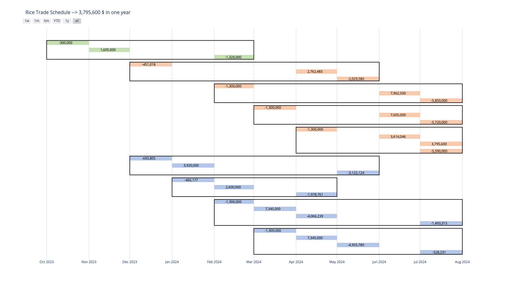

# Rice Trade Scheduler

## Table of Contents
1. [Overview](#overview)
2. [Features](#features)
3. [How It Works](#how-it-works)
4. [Usage](#usage)
5. [Requirements](#requirements)
6. [Installation](#installation)

## Overview

The Rice Trade Scheduler is a sophisticated Mixed-Integer Dynamic Programming (MIDP) model designed to optimize the scheduling of rice trades. It supports various rice types such as 'super', 'kanait', and 'cheap', each with their own buying, payment, and selling schedules. The model operates on an initial investment of $300,000, incorporating a deposit percentage and variable profits for different rice types.

## Features

- **Flexible Time Frames:** Supports various time frames for buying, paying, and selling for different types of rice.
- **Dynamic Profit Calculation:** Includes different profit margins for each rice type, reflecting real-world complexities.
- **Interest Rate Integration:** Accommodates fluctuating interest rates into the payment scheduling.
- **Optimization Goal:** Aims to maximize the total cash flow by the end of the trading period.
- **Automated Schedule Visualization:** The output of the MILP model is used to generate a Gantt chart that visualizes the trade schedule.

## Visualization
The automated visualization component translates the model's output into a clear, graphical Gantt chart. Here is a snippet of the code that generates this visualization:


## How It Works

The scheduler uses Linear Programming (LP) to maximize profits while adhering to the constraints of trade schedules and initial investments. It includes the following key components:

- **Decision Variables:** Define the quantities of each rice type to buy, pay, and sell across different months.
- **Objective Function:** Maximizes the total cash flow, specifically the bank balance at the end of the trading period.
- **Constraints:** Ensures the feasibility of the trade schedule, including deposit percentages and balancing of buying, selling, and payments.

## Usage

To run the Rice Trade Scheduler, you will need a linear programming solver like CPLEX. The model is defined using the Python PuLP library. Here is a brief on how to use the model:

1. **Set Up Your Environment:** Make sure Python is installed along with the PuLP library and CPLEX solver.
2. **Customize Parameters:** Adjust the rice_types, interests, and other parameters as per your requirements.
3. **Run the Model:** Execute the script to find the optimal trade schedule.

## Requirements

- Python 3.7
- PuLP
- CPLEX Solver (or any LP solver compatible with PuLP)

## Installation

Clone the repository and install the dependencies:

```bash
git clone [repository-url]
cd [repository-name]
pip install -r requirements.txt
```